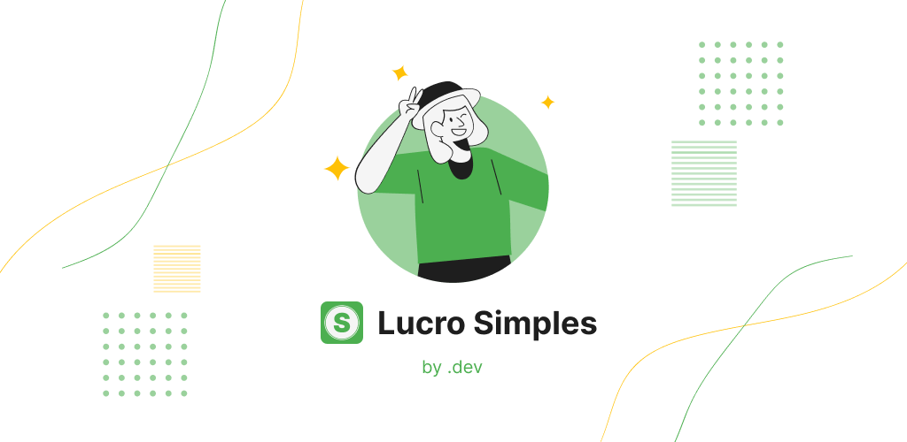

# Lucro Simples

O Lucro Simples foi desenvolvido como um projeto pessoal para ajudar pequenos empreendedores que trabalham com doces, bolos, roupas, entre outros produtos.



Disponível gratuitamente para dispositivos Android, o app é direto e intuitivo, com ele os usuários podem:

✅ Cadastrar Produtos e Clientes  
✅ Registrar Vendas  
✅ Enviar Comprovantes para os Clientes  
✅ Acompanhar Faturamento e Lucro por período

Fique à vontade para baixar e testar, [**clique aqui**](https://play.google.com/store/apps/details?id=com.dotdev.lucro_simples&hl=pt_BR)

## ⚙️ Parte Técnica

Aqui quero compartilhar um pouco do processo de desenvolvimento, e como penso para tomar algumas decisões.

### 🏗️ Arquitetura

A Arquitetura deve estar alinhada com o contexto do projeto, aqui optei por simplificar e evitar over-engineering, garantindo um **código organizado** e pronto para **evoluir**.

Assim tenho um equilíbrio para entregar rapidamente o MVP do projeto e futuras melhorias.

### 🔗 Repositories

Optei por utilizar **repositories** com **inversão** e **injeção** de dependências para facilitar a manutenção e a troca no futuro.

No momento utilizo o Sqlite para armazenar os dados, mas futuramente posso implementar um banco de dados online rapidamente.

### ↕ Migrations

Desenvolvi uma lógica simplificada de migrations para organizar as mudanças no banco de dados, e ainda sobre ele, lidei como se estivesse em **produção**, optando por modificar o banco sem perder os dados cadastrados durante o desenvolvimento.

Isso me trouxe desafios muito parecidos com os que lido no dia a dia.

### 📖 Gerenciamento de Estado

Aqui uma exceção, acoplei o ChangeNotifier na entidade Sale transformando-a em praticamente uma model. Fazia mais sentido neste contexto, consegui centralizar a funcionalidade de venda no app muito rapidamente e com fácil manutenção.

Apesar de não ser o ideal em projetos grandes, e o custo benefício disso no momento se mostrou melhor.

### 🧪 Testes

É muito legal ter uma alta cobertura de testes no código, porém isso demanda tempo, por isso foquei no essencial para o bom funcionamento do app.

Comecei pelos de integração com o banco de dados, eles foram cruciais para garantir as diversas mudanças que fiz ao longo do desenvolvimento.

Depois fiz os teste unitários do processo de venda para garantir que todos os cálculos estão certos e vão continuar após mudanças futuras.

E por fim, os testes de widget para garantir que a interface da venda.

Poucos testes, mas de muito impacto para o projeto.

### 💡 Considerações finais

Esse projeto reflete um pouco do meu modo de pensar como desenvolvedor, busco sempre encontrar o equilíbrio, para entregar o projeto rápido, funcional e manutenível.

Se tiver dúvidas ou sugestões, pode me chama! Ficarei feliz em ajudar.

Obrigado pela atenção 😊

LinkedIn: [**Maicon Jhone**](https://www.linkedin.com/in/maicon-jhone-84568b189/)

## 🚀 Primeira vez com Flutter?

Sem problemas! Para rodar o projeto, siga estes passos:

1️⃣ Baixe as dependências

```sh
 flutter pub get
```

2️⃣ Execute o projeto

```sh
 flutter run
```

💡 Recomendo rodar em um dispositivo ou emulador Android/iOS para a melhor experiência.

Pra instalar o [**Flutter**](https://docs.flutter.dev/get-started/install?_gl=1*33a0gk*_ga*MTMzMjA1NjEzNy4xNzM2NjA4MzAw*_ga_04YGWK0175*MTczODg5ODQzNC4zLjAuMTczODg5ODQzNC4wLjAuMA..)
